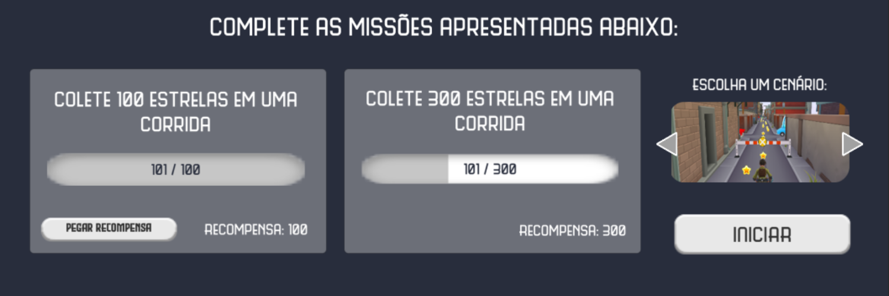

# MindWave Runner

> An endless runner game that uses MindWave data to control the character's speed. The game presents two race tracks options and other attention activities.

## 🚀 Code and tools
The following tools were used to build this project:

* [C#](https://docs.microsoft.com/dotnet/csharp/);
* [Unity](https://unity.com);
* [MindWave NeuroSky](http://developer.neurosky.com/docs/doku.php?id=mindwave);
* [ThinkGear Connector](http://developer.neurosky.com/docs/doku.php?id=thinkgear_connector_tgc).

## 💻 Requirements

Before start, make sure you've met the following requirements:
* You have all MindWave drivers installed (see [instalation guide](http://developer.neurosky.com/docs/doku.php?id=mindwave));
* You have ThinkGear Connector installed;
* You have Unity and a code editor installed (e.g. Visual Studio Code);

## ⚡ Running the game

After installing the requirements, follow these steps to run the game on your computer:
* Open the project in Unity;
* Configure the [MindWave Unity Plugin](https://github.com/hubertgdev/mindwave-unity);
* Run ThinkGear Connector and turn on the headset;
* Press "play" button to start the game.

## 🎯 Features

The game has the following features:
- [x] Two options of race tracks to run;
- [x] Missions and rewards;
- [x] Two extra activities to train attention and to relax.

### Author
Made with ❤️ by Giulia Tondin 👋 <a href="https://github.com/giuliatondin">Get in touch!</a>
